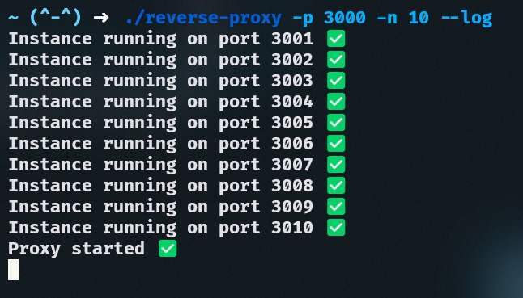

<h1 align="center"> Reverse Proxy </h1>

<p align="center"> Reverse Proxy is a simple Go library to spawn multiple HTTP instances behind a reverse proxy. </p>

<div align="center">

</div>

## 📦 How to use

You can install the reverse-proxy cli using the following command:
```bash
go get github.com/luique16/reverse-proxy@latest
```

Then, import the library in your code:

```go
import "github.com/luique16/reverse-proxy"
```

And use the `Run` function:

```go
reverse_proxy.Run(port, num, server, log)
```

- `port` is the port to listen on
- `num` is the number of instances to run
- `server` is the server mux
- `log` is a boolean that indicates if the proxy should log all instances created and the redirections made

Here's an example:

```go
package main

import (
    "net/http"
	"github.com/luique16/reverse-proxy"
)

func main() {
	mux := http.NewServeMux()

	mux.HandleFunc("/", func(w http.ResponseWriter, r *http.Request) {
		w.Write([]byte("Hello World!"))
	})


	reverse_proxy.Run(3000, 3, mux, false) // Port 3000, 3 instances
}
```

## 📝 Details

- Incoming requests on the base port are load-balanced in round-robin fashion to the spawned instances.
- The instances ports will be the next available ports after the base port.
- The library automatically identifies the available ports and creates instances.
- If the `log` argument is true, the proxy will log all instances created and the redirections made.

## 💻 CLI

If you want to test the library, you can use the CLI. You can install it using the following command:

```bash
git clone https://github.com/luique16/reverse-proxy.git

cd reverse-proxy
```

Then, build the binary using the following command:

```bash
go build -o reverse-proxy cmd/execute.go
```

After that, you can use the binary to run the proxy:

```bash
./reverse-proxy
```

The CLI has the following options:
- `-p` or `--port` is the port to listen on
- `-n` or `--num` is the number of instances to run
- `-l` or `--log` is a flag that indicates if the proxy should log all instances created and the redirections made

Here's an example:

```bash
reverse-proxy -p 3000 -n 3 -l
```

This will start a proxy on port 3000 with 3 instances and use the log option.

## ✅ TODO

- [ ] Check instances health
- [ ] Add tests

<p align="center">Feel free to open an issue or a pull request if you have any ideas or suggestions. </p>
